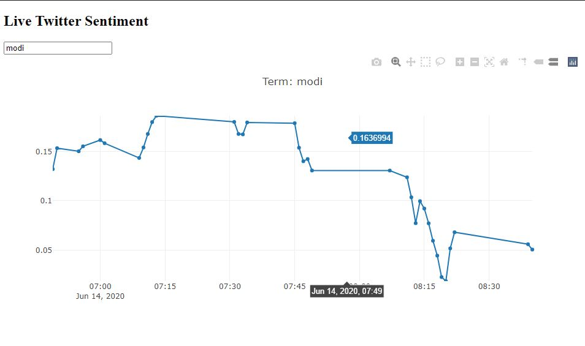

# TwitterSentiment_App_using_Dash
* Twitter Sentiment Analysis using NLP and creating Dashboard using Dash & plotly.
* This is from a tutorial series that I followed created by Sentdex. 

# How to run :
* Clone this repo
* Run the Twitter&Dash1.ipynb in the background.-- This will need a twitter developer account and App to access the API.
* Run the Twitter&Dash2.ipynb. -- This will run the Dash Application (on localhost) with the live graph updating from the incoming tweets.
* The output should look something like this : You can enter any keyword and track it's sentiment.

